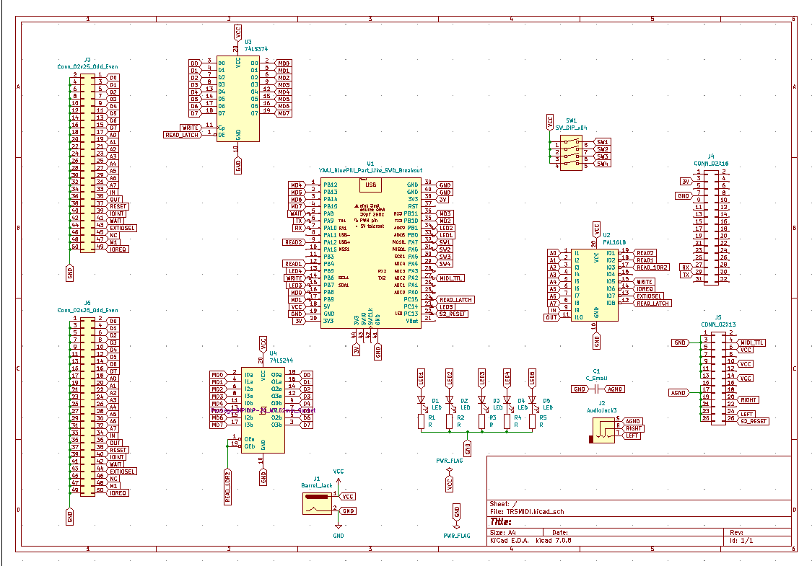

# MIDI/80 
## A MIDI Sound & Interface Card for the TRS-80 Model 1, III, and 4 

#### Hardware & Firmware: [Michael Wessel](https://www.michael-wessel.info/) 
#### Z80 Wizardry and TRS-80 Zmac Assembler Advisor: [George Phillips](http://48k.ca/) 
#### Beta Testers: [Jürgen Wich](https://homecomputerguy.de/en/) (Model 1 Version), [Joel Hilliard (Model III / 4 Version)](https://www.youtube.com/@joelhilliard8298)
#### License: GPL 3

## News 

### January 2025

Jürgen Wich has uploaded a demo video showcasing the MIDI/80 MIDI playback capabilities with his Model 1 - cool stuff!

https://youtu.be/vjVPdRUbgE4


### December 2024

- Cool TRS-80 Orchestra + MIDI/80 music performance by Joel Hilliard
on the Model 4 and 4p (using `STORCH/CMD` and `TRACKER/CMD` for S2 drums). 

https://www.youtube.com/watch?v=8xH_k91aPCo


### November 2024 

- Jürgen Wich (the "Homecomputerguy.de") was one of the beta testers for
the Model 1 version, and has just uploaded his review - thanks, Jürgen!


https://homecomputerguy.de/en/2024/11/24/midi-80-trashy-spits-out-new-sounds/

- MIDI/80 is *featured project* on Hackaday.com!


- This Github goes online. Firmware, Gerbers, and sources released to the public.
- The first beta tests were a success! Both Jürgen and Joel have successfully used MIDI/80 with their TRS-80s. 

### October 2024

[MatrixSynth](https://www.matrixsynth.com/search?updated-max=2024-10-31T14:06:00-07:00&max-results=10) posted about MIDI/80 - thanks! 


## About

**MIDI/80 is a MIDI Sound & MIDI Interface card for the TRS-80 Model 1, III, and 4.**


TRS-80 Model with Expansion Interface, MIDI/80, and Orchestra 85 replica: 


TRS-80 Model III with MIDI/80 and FreHD HD emulator connected to the
MIDI/80 expansion port pass-through edge connector:

 

MIDI/80 on a TRS-80 Model 4 with [TRS-IO++](https://youtu.be/tV7D6_IFSac): 

 

### Features 

MIDI/80 offers: 

- A powerful and sonically impressive, versatile General MIDI (GM)
  sound & MIDI interface card for the TRS-80 Model 1, III, and 4. 

  GM sound is either produced by a Waveblaster-compatible soundmodule
  that plugs onto MIDI/80's Waveblaster header, or via a GM expander
  (such as the Roland Sound Canvas SC-55 or Roland MT-32) conntected
  to MIDI/80's MIDI OUT DIN socket. MIDI data can be sent to
  either or both of these devices. Both the Waveblaster module as well
  as the MIDI DIN sockets are optional, but in order to act as a soundcard,
  either of these options need to be present. 

- Standard MIDI IN & MIDI OUT DIN sockets (optional) turn your
  TRS-80 into a powerful MIDI processor. You can connect a standard
  MIDI keyboard to the MIDI IN DIN socket, and record MIDI messages
  with the TRS-80 into memory. MIDI messages can also be played back
  from the TRS-80 memory. The MIDI data recording is fast enough to
  allow for the real-time recording of entire multi-track complex
  GM songs, i.e., from a PC playing back a `.MID` MIDI file via
  [MIDIBAR](http://www.midiox.com/).

- Stand-alone mode: equipped with a [Waveblaster sound module](https://www.serdashop.com/RetroSoundcards), 
  MIDI/80 is also a "headless" GM expander, not unlike the Roland 
  Sound Canvas SC-55 (without display though). The MIDI/80 firmware
  provides a standalone MIDI mode - this mode is enabled
  by putting DIP Switch `3` into "ON" position. No TRS-80 is required
  in this standalone mode, only a 5 V power supply and an external
  amplifier. 

- Compatible with popular TRS-80 standard expansions: Model 1
  Expansion Interface, FreHD, Orchestra soundcards, [Talker/80](https://github.com/lambdamikel/Talker-80), etc.

- OpenSource BluePill firmware, Gerbers, and TRS-80 software available here. 

- TRS-80 software available, and more under development:
  Drum Pattern Tracker, MIDI Recorder, TRS-80 Synthesizer, etc.

- DIY friendly: only thru-hole and off-the-shelf components are used.

- Inexpensive: MIDI/80 can be assembled for ~35 USD. The most significant
  cost factor is the Waveblaster module, if required. If you already
  own an external MIDI expander such as the Roland Sound Canvas or similar,
  no Waveblaster plugin module is required.

### Technical Details 

- Requires standard 5V "wall wart" power supply; 1 to 2 Amps, center
  positive.

- Requires an external stereo amplifier to be connected to the
  standard 3.5 mm stereo audio jack. 

- Powerful [BluePill STM32F103C8T6 Microcontroller](https://www.amazon.com/gp/product/B07VKSVM21) clocked at 75 MHz (ARM Cortex-M3).

- Compatible with all Waveblaster soundcards from
  [Serdashop](https://www.serdashop.com/) that don't require a 12 V
  supply.

  

- Uses off-the-shelf [Adafruit MIDI breakout
  module.](https://learn.adafruit.com/adafruit-midi-featherwing) The
  MIDI sockets are optional, as is the Waveblaster sound module.

- Five activity LEDs that indicate read and write activity on the
  TRS-80 IO bus related to MIDI/80, as well as incoming and outgoing
  MIDI message activity. Useful for debugging MIDI problems.

- Full TRS-80 expansion port pass-through. MIDI/80 is a "good citizen
  on the bus" and compatible with Talker/80, FreHD, Orchestra 85 and
  90, etc. 

- Reset button on the BluePill microcontroller.

## Demo Videos

You can get a better understanding of MIDI/80's capabilities and features by watching some of these YouTube demo videos: 

- ["MIDORG/CMD" - MIDI/80 TRS-80 synthesizer demo](https://youtu.be/PCqYC7ioWr4)
- [Playback of some complex GM songs from Model III RAM](https://youtu.be/CnN0iCrYn2c) 
- ["TRACKER/CMD" - MIDI/80 drum tracker demo](https://youtu.be/1idltIlOM_4)
- ["MIDORCM/CMD" - George Phillips' MIDI/80 + Orchestra organ program](https://youtu.be/yXoREGdIvFE)
- ["RECPLAY/CMD" - Realtime recording and playback of very complex MIDI data with the Model III ](https://youtu.be/S-FNLHkRXPA)
- ["RECPLAY/CMD" - Realtime recording and playback of very complex MIDI data with the Model 1](https://youtu.be/qzGTzsKHLxc)
- [MIDI/80 and external MIDI expanders - GM song playback with the Roland MT-32 connected to MIDI OUT DIN socket](https://youtu.be/-t2AQeoQEGI)

## Overview & Usage 

Connect the IDC box header at the bottom to your TRS-80 Model.


Use the pass-through edge connector to connect other hardware (e.g., the
Model 1 Expansion Interface, or a FreHD) to MIDI/80.

MIDI/80 requires a dedicated external 5V standard center-positive "wall wart"
power supply (1A is sufficient).

It is recommended to power-on MIDI/80 before the other TRS-80 equipment. 

### Installation Notes 

- For the Model 1, the 40 pin ribbon cables should be as short as
possible.  If the Model 1 Expansion Interface (EI) is being used, then
MIDI/80 should be connected directly to the Model 1, and *not* to the EI
expansion port edge connector (front-left side edge connector at the
EI). See this picture for a proper setup: 


- For the Model III, it is convenient to place MIDI/80 directly on top
of the machine. The expansion port cable runs along the rear side of
the console, to the top. Connect additional external hardware such as
your FreHD directly to MIDI/80's pass-through expansion port edge
connector, as shown in this picture:

 

*Moreover, it is important that expansion cards connected to MIDI/80's
pass-through connector use a fully connected 50pin ribbon cable!* This
is necessary in order to avoid crosstalk, as every other strand of the
50pin ribbon cable is GND. It was found that the 50pin card edge
connector of an Orchestra 90 replica board using only a 40pin ribbon
cable (hence, 10 pins of the 50pin card edge connector were left
non-connected to MIDI/80's pass-through connector, as Orchestra 90
doesn't require these signals for operations) resulted in MIDI/80
databus read failures. Switching to a fully connected 50pin ribbon
cable fully resolved the issue.

- For the Model 4, the above notes for the Model III apply. In addition
the Model 4 must be run in `SYSTEM (SLOW)` mode, as MIDI/80 only supports
the 2 MHz max CPU speed from the Model III; so the Model 4 must be operated
in Model III mode if MIDI/80 is to be used.

### Operating MIDI/80 

MIDI/80 is equipped with a **RESET button** 


a **4-position DIP switch**, and **5 activity / status LEDs:** 


Please note the following: 

1. **The RESET button** is on the BluePill microcontroller. 
   
   Use the RESET button at any time; the TRS-80 is not affected by a
  reset. A push to the RESET button will also reset the on-board
  Waveblaster module and clear (turn off) any potentially stuck notes.

2. The **five activity & status LEDs** indicate the following:
   - **Upon RESET / Power On,** the LEDs are tested for function and then briefly display the current DIP switch setting. 
   
      This is useful for testing
      proper operation of the DIP switch (i.e., that all switches are
      working). The default DIP SWITCH setting is `ON-ON-OFF-ON`.
  
   - At runtime, the LEDs have the following function:
     - **DATA-IN**: Data is received from the TRS-80 via IO port `8`. 
     - **MIDI-IN**: MIDI data is received via the MIDI IN DIN socket. 
     - **DATA-OUT**: Data is sent from the BluePill microcontroller
       to the TRS-80. The repective
       IO ports are `8` and `9` (see below). 
     - **S2-OUT**:  MIDI data is sent from the BluePill microcontroller
        to the internal Waveblaster connector. 
     - **MIDI-OUT**: MIDI data is sent from the BluePill microcontroller
       over the MIDI OUT DIN socket. 


3. The **four DIP switches** are used for selecting the operating mode of MIDI/80.

    **From left to right, the switches 1 to 4 have the following functions** 
    (note that there are also small labels under the buttons on the PCB
    silkscreen). In the following, `x` is either `M1` (for the Model 1
    version), or `M3` (for the Model III, Model 4 version):

   - **x --> S2**:  Determines if data received over IO port 8 from the TSR-80 
      is forwarded to the internal Waveblaster plugin module. Default setting
      is `on`. 
   - **x --> OUT**: Determines if data received over IO port 8 from the TSR-80 
      is forwarded to the MIDI OUT DIN socket. Default setting is `on`.  
   - **IN --> S2**: MIDI/80 standalone GM expander mode. Determines if data 
      received over the MIDI IN DIN socket is automatically forwarded to the
      Waveblaster plugin module. Default setting is `off`. 
      
      This is a function
      of the MIDI/80 firmware, i.e., the BluePill is doing this autonomously,
      without TRS-80 involvement. You only need a 5V power supply and an external
      amplifier, and can use MIDI/80 as a very capabale GM expander module
      for your Waveblaster sound module with this mode. 
   - **IN --> OUT**: Determines if data received
      over the MIDI IN DIN socket is automatically forwarded to the
      MIDI OUT DIN socket. 
   
      This, again, is a function 
      of the MIDI/80 firmware, i.e., the BluePill is doing this autonomously,
      without TRS-80 involvement. It basically implements a MIDI THRU
      function; note that this function is not exclusive to the MIDI OUT
      socket. The TRS-80 can also still send out data over it. 


**Note: After a change to the DIP switch, a RESET is required in order
for the change to become effective (use the RESET button on the
BluePill).** 

### Operating System Notes

On all systems, *LDOS 5.3.1* is the default operating system for which
the software is developed. Model 4 users must configure their machine
via `SYSTEM (SLOW)` for MIDI/80.

The MIDI/80 programming examples in BASIC are written in LBASIC (LDOS
BASIC) and are not guaranteed to work with the other BASIC dialects.

All other programs are written in Z80 assembly using George Phillips'
Zmac assembler and `trs80gp` emulator as development toolchain.

## Theory of Operation

MIDI/80 implements a FIFO queue with a capacity of 256
bytes for buffering incoming MIDI messages which are received over the
MIDI IN DIN socket. The status of this buffer can be queried by reading from IO
port `9` - a `1` indicates MIDI bytes are queued for retrieval from the
buffer, and a `0` indicates an empty buffer. MIDI bytes can then be
retrieved from the FIFO by reading from IO port `8`.

If the standalone mode is turned on, i.e., DIP switch `3` is set to on,
then all MIDI data bytes received over MIDI IN are also automatically
forwarded to the Waveblaster module. 

If MIDI THRU is turned on, i.e., DIP switch `4` is set to on, then MIDI
data bytes received over MIDI IN are also automatically forwarded to
the MIDI OUT DIN socket.

MIDI data bytes received by MIDI/80 from the TRS-80 via port `8` will
not be buffered, but, depending on the settings of DIP switches `1` and
`2`, immediately be forwarded to either the Waveblaster pluging module,
and/or the MIDI OUT DIN socket, or both or none. Both routes can be
turned on or off individually, and independendly of each other.

MIDI/80 is implemented using 4 ISR (Interrupt Service Routines).
There is a pair of ISRs for handling reads and write to TRS-80 IO port
8, and one ISR for handling IO port `9` reads. Another ISR is
responsible for putting MIDI bytes received via the MIDI IN socket
into the FIFO buffer. The MIDI ISR has priority over the ISRs serving
the TRS-80 IO - the Z80 CPU may be put into WAIT state in case these
events happen concurrently.

The BluePill does the heavy lifting, but requires some help from 
three additional glue logic support chips in order to meet the 
strict bus timing constraints of the TRS-80 with a "not quite 
fast enough" microcontroller such as the BluePill @ 72 MHz: 

- A **GAL16V8** is primarily used as an address decoder for IO ports `8` and `9`. It notifies the BluePill and triggers the appropriate ISRs. It also implements some glue logic for driving the other two support chips. 
- A **74LS244** is used to decouple TRS-80 databus read requests from the BluePill databus. 
- A **74LS374** is used to decouple TRS-80 databus write requests from the BluePill databus. 

In combination, the 74LS244 and 74LS374 greatly relax the 
timing constraints on the BluePill ISRs. Without them, the design would not work. 

## MIDI/80 Software for the TRS-80

Note that many of these programs are demonstrated on the YouTube
MIDI/80 channel (see above). 

There is a set of [MIDI/80 song disks](trs-80/) containing GM songs for
playback, simply for listening pleasure.  These also serve as
standalone demos. See below for info on how to make your own songs for
MIDI/80.  The software is under development, and there might be
frequent or infrequent updates in the future.

The programs on the [`MIDI80.DSK`](trs-80/model-3/dsk/MIDI.DSK), [`MIDI80_DSK.HFE`](trs-80/model-3/hfe/MIDI_DSK.hfe) Model III disk images are:

- `ALF/CMD`, `TOCCATA/CMD`: MIDI Demo songs; playback of complex GM data from TRS-80 RAM. 

  

- `MIDORG/CMD`: Turns your TRS-80 into a full-blown polyphonic
multitimbral MIDI keyboard. You can play the Waveblaster (S2) or an
externally connected GM expander with your TRS-80 keyboard. This is
joint-work with George Phillips, as the program uses his keyboard
scanning and self-modifying key handler code. 

  

- `TRACKER/CMD`, `TREACKER1/CMD`: A drum pattern sequencer for your TRS-80. `TRACKER1/CMD` allows realtime tracking / recording over the MIDI drum channel (10) from a
  connected MIDI keyboard / synthesizer (via MIDI IN). 

   

   

- `RECPLAY/CMD`: A MIDI data recorder and MIDI data playback device. You can record the incoming MIDI IN data stream into TRS-80 RAM, and play it back from there. This program is fast enough to support real-time recording of entire complex GM songs, as demonstrated in [this demo]. In a future version, it will be possible to save (resp. load) the recorded MIDI data (GM songs) to (resp. from) disk.  

   

- `DRUMS/CMD`: A simple program demonstrating how to program MIDI/80
  with Z80 assembly language. Use your TRS-80 keyboard to play the
  MIDI drum channel (channel 10). The ASCII codes of the keys are
  mapped to instrument numbers.

   

- `MIDIMON/BAS`: A simple MIDI monitor. Prints MIDI data bytes to the 
  screen. Useful for debugging
  MIDI issues. Also demonstrates how to query the FIFO buffer from LBASIC. 

  

- `MIDITRU/BAS`: A simple MIDI SOFT THRU implementation in
  LBASIC. Simply forwards any MIDI byte received via MIDI IN DIN
  socket to either the Waveblaster, to the external MIDI OUT DIN
  socket, both, or neither, depending on the DIP switch settings (1
  and 2). Also demonstates how to query the FIFO buffer from LBASIC,
  and how to send MIDI data from BASIC.

- `BASDRUM/BAS`: The LBASIC version of the simple drum program above, but
  unlike `DRUMS/CMD`, it's much more laggy (it's BASIC!), and it only supports
  keys 0 to 9. Unlike `DRUMS/CMD`, these keys are mapped to sensible MIDI drum
  notes on channel 10 (e.g., 0 is mapped to the bass drum, etc.)

- `NOTES/BAS`: Simple LBASIC program that demonstrates how to send
  MIDI NOTE ON and MIDI NOTE OFF messages. Plays all 127 notes of the
  Waveblaster, and/or external MIDI module, depending on the DIP
  switch settings (1 and 2).


There is also some software that was written by [George Phillips]()
that requires an Orchestra 85 (Model 1) or Orchestra 90 (Model III,
Model 4) soundcard: 

- `MIDORCM/CMD`: With this program you can play your Orchestra (85, 90)  interactively via a MIDI keyboard connected to MIDI/80's MIDI IN
socket. It is monophonic. The program is somewhat "picky" as it requires
a proper MIDI NOTE OFF message to turn of a note. Note that some
MIDI keyboards choose to send a MIDI NOTE ON message with velocity
(= "volume") 0 instead. Also, key roll-over is not implemented yet.

- `STORCH/CMD`: Allows you to play the Orchestra (85, 90) soundcard
  with your TRS-80 keyboard. The program can generate different wave
  forms (sine, square, saw, triangle), and utilizes both the left and
  the right channel of the Orchestra - each channel can be played via
  a dedicated row of keys (one octave) from your TRS-80 keyboard!
  Even the channel volumes can be changed. 

  
  
### Creating Your Own Songs for MIDI/80 Playback 

Use the `.MID` to `.BIN` file converter. The converter is written  
in Python, and [provided as a Windows executable here.](converter/)


There are [a few MIDI files here you can start with](midi/).  

The converter will convert a MIDI `.MID` file into a set of 
16 KB `.BIN` fragments. A fully expanded Model 1 allows you to 
fit about ~43 KBs of song data into memory. 

In order to create your own `MYSONG/CMD` file, proceed as follows. 

1. Edit the [`CANYON.ASM`](trs-80/zmac/canyon.asm) Zmac assembly program as a blueprint. First, make a copy, give it a reasonable name, e.g., 
  `MYSONG.ASM`. 

    Then, change the line
   
       `title2		defb  '    CANYON.MID', ENTER` 

      by replacing `CANYON.MID` with your song title, e.g., `MYSONG.MID` 

2. Include as many of the the generated `.BIN` fragments of your 
   song as possible by replacing the following lines

    ```   
	incbin "./canyon0.BIN"
	incbin "./canyon1.BIN"
	incbin "./canyon2.BIN"      
    ```

    with the proper file names for your song: 

    ```
    incbin "./mysong0.BIN"
    incbin "./mysong1.BIN"
    ...
    ```

3. Next, [download and install Zmac](http://48k.ca/zmac.html) as well as [trs80gp](http://48k.ca/trs80gp.html), and assemble 
the program from the command line as follows: 

    ```     
    zmac$ ./zmac maysong.asm 
    ```

    Then, test the generated CMD / program in the `trs80gp` emulator: 

    ```     
    zmac$ ./trs80gp -ld zout/mysong.cmd
    ```

    Note that the playback program display RAM region occupied by the
    binary song data: 
    
    
    
    The song data must stay below `$FFFF`; if the value of the display 
    end address is smaller than the start address, then the 
    memory "wrapped around" and the song data did not fit. LDOS
    will not allow loading the program in this case (as it would
    need to overwrite the ROM, which is impossible). 

Note: You can use [TRSTOOLS](http://www.trs-80emulators.com/trstools/) to add the generated `MYSONG.CMD` to a DSK image, and convert this DSK 
image into HFE format using [HxC](https://hxc2001.com/). 

## MIDI/80 Programming

Have a look at the [LBASIC demo programs on the DSK images](trs-80/model-3/), and the [`DRUMS/CMD` assembly program.](trs-80/zmac/drums.asm)

## MIDI/80 Hardware

This section provides all necessary files and information for a DIY
build of MIDI/80. Costs are in the ~35 USD range (without a
Waveblaster module; add another ~40 USD for the S2, but prices vary).

### Schematics 

[Model 1 Version (PDF)](gerbers/model-1/schematics.pdf)


[Model III / 4 Version (PDF)](gerbers/model-3/schematics.pdf)



### Bill of Material (BOM)

- 40 (Model 1) or 50 (Model III & 4) pin IDC box header 
- 40 or 50 pin ribbon cable 
- 40 or 50 pin card edge connector 
- [3.5 mm stereo jack](https://www.amazon.com/gp/product/B077D1NY4T/)
- [BluePill microcontroller](https://www.amazon.com/gp/product/B07VKSVM21/) (and ability to program / flash it, e.g., using a [ST-Link V2 BluePill programming cable](https://www.amazon.com/gp/product/B01EE4WAC8/))
- GAL16V8 + DIP socket (and ability to program it, e.g., using TL-866 MiniPro Programmer) 
- 74LS244 + DIP socket
- 74LS374 + DIP socket 
- 5 (5mm) LEDs of your liking and matching current limiting resitors (1 or 2 kOhm)
- 4-position DIP switch 
- **C1** in the schematics (and on the PCB) is actually not a capacitor, but a cable / wire bridge
- [L Type Mounting Feet](https://www.amazon.com/gp/product/B07DHHS1Q8)
- [Standard 5V DV power plug jack (5.5x2.1mm socket)](https://www.amazon.com/gp/product/B081DYQSC9/)
- [Standard 5V "wall wart" external power supply (center positive)](https://www.amazon.com/gp/product/B08722QC75)
- [Dual-row breakable pin headers](https://www.amazon.com/Cylewet-2%C3%9740Pin-Breakable-Straight-Connector/dp/B06XR2SG64) 
- Optional: [Waveblaster module](https://www.serdashop.com/RetroSoundcards)
- Optional: [Adafruit MIDI Feather](https://www.adafruit.com/product/4740) and [Single Row Straight Female Header Socket Connector for Arduino](https://www.amazon.com/gp/product/B07J5B9LT5) 

### PCB Gerbers 

The PCB Gerbers are contained in Zip archives and can directly 
be send-off to major PCB manufacturers (PCBWay, Seeed, OshPark, JLCPCB): 

- **[Model 1 Version:](gerbers/model-1/gerbers-m1-holes.zip)**


- **[Model III / 4 Version:](gerbers/model-3/gerbers-m3-holes.zip)**


### Assembly Notes

Note the proper IDC header orientation, i.e., the position of the "notch" differs between Model 1 and Model III / 4 version! 

- On the Model 1 version, the 40pin IDC box header notch faces **towards the edge connector.**
- On the Model III / 4 version, the 50pin IDC box header notch faces **away from the edge connector.**


## Firmware

Here are the required firmware files for the GAL16V8 and BluePill microcontroller. 


**Model 1 Version:**
- [GAL16V8 JED firmware file](firmware/gal16v8/model-1/MIDI80-Decoder.jed) 
- [GAL16V8 PLD sources](firmware/gal16v8/model-1/TRSMIDI.PLD)

**Model III / 4 Version:** 
- [GAL16V8 JED firmware file](firmware/gal16v8/model-3/MIDI80-Decoder.jed) 
- [GAL16V8 PLD sources](firmware/gal16v8/model-3/TRSMIDI.PLD)


Installation of the STM32 FreRTOS and GCC development toolchain is explained in Warren Gay's 
book ["Beginning STM32 - Developing with FreRTOS, libopencm3 and GCC"](https://www.amazon.com/Beginning-STM32-Developing-FreeRTOS-libopencm3/dp/1484236238/), which I can recommend. 

With [the development toolchain](https://github.com/ve3wwg/stm32f103c8t6) installed and 
configured correctly, and an ST-Link V2 USB programmer  
connected, the [BluePill firmware](firmware/bluepill/) can be compiled and uploaded 
onto the BluePill simply by executing 

```
make clean
make
make flash 
```

from the command line. I am using Linux for this, even though CYGWIN is mentioned as
a possibilty in the aforementioned book. 

## Acknowledgements

- [Warren Gay](https://github.com/ve3wwg/) for his book 
  ["Beginning STM32 - Developing with FreRTOS, libopencm3 and GCC"](https://www.amazon.com/Beginning-STM32-Developing-FreeRTOS-libopencm3/dp/1484236238/)
  which provided the starting point and basis for this work. 

- [George Phillips](http://48k.ca/)

- [Jürgen Wich](https://homecomputerguy.de/en/)

- [Joel Hilliard](https://www.youtube.com/@joelhilliard8298)
 