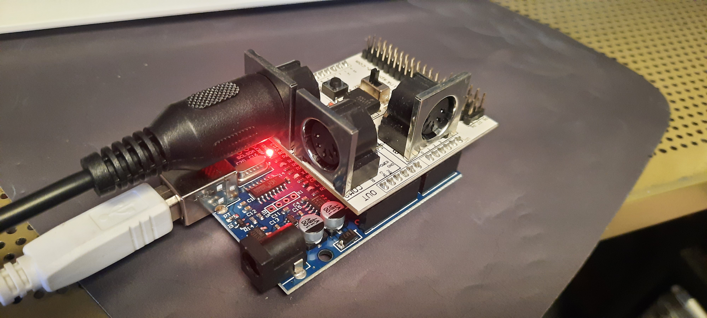

# MIDI/80 External Clock Box

An Arduino Uno with a MIDI shield that converts incoming **MIDI beat
clock** into the **parallel port step pulses** TRACKER already
understands in external clock mode (`'`), so a DAW, drum machine or
groovebox can drive a TRS-80 running TRACKER.



*The built module: an Arduino Uno clone with the MIDI shield stacked on
top. The small slide switch beside the pushbutton is the one that must
be **OFF** to upload a sketch and **ON** to receive MIDI — it gates the
`D0`/`D1` UART lines that the bootloader also needs. MIDI from the
master goes into the shield's IN socket; USB provides power and
programming. The step output to the TRS-80 is taken from `D8` and `GND`
on the headers, not yet fitted here.*

## Why a separate box

TRACKER cannot recover an incoming MIDI clock itself. Profiling its main
loop in the trs80gp bus trace showed a **~27 ms contiguous work block
per step** during which it never reads the MIDI/80 FIFO. At 120 BPM an
`F8` arrives every 20.8 ms, so at least one clock per step always lands
inside a blind window. The FIFO preserves the *bytes*, but it destroys
their *arrival times* — and clock recovery needs timestamps, not counts.

A dedicated ATmega328 does nothing else, so it timestamps every byte
within microseconds. Measured on the Arduino's own clock: **sd 0.15 ms**
over 48 steps, against TRACKER's own ~4.4 ms clock jitter.

TRACKER sends clock well (see 1.99 / 2.00) precisely because it *knows*
when its own step happened. It receives badly for the same reason
inverted. This box handles the direction TRACKER is bad at.

## Hardware

| | |
| --- | --- |
| Board | Arduino Uno (or any 16 MHz ATmega328 — 31250 baud divides exactly, `UBRR = 31`, zero error) |
| Shield | LinkSprite MIDI Shield, SparkFun MIDI Shield, or any shield using the hardware UART |
| Flash used | 2606 bytes (8%), 203 bytes RAM |

The Uno is **5 V**, so it drives the TRS-80's TTL printer-port input
directly with no level shifting. A 3.3 V board would work
(TTL V<sub>IH</sub> is 2.0 V) but is less comfortable.

## Pin assignment

Every GPIO the sketch touches. All pin numbers are constants at the top
of `midiclock-uno.ino`, so they are easy to move if your shield differs.

| Pin | Dir | Function | Connects to |
| --- | --- | --- | --- |
| `D0` / RX | in | **MIDI IN** (hardware UART) | shield's MIDI IN socket |
| `D1` / TX | out | MIDI OUT — unused, kept silent | shield's MIDI OUT socket |
| `D8` | out | **step clock**, one toggle per step | TRS-80 Centronics pin 21 (`BUSY`), **via 220–470 Ω** |
| `D9` | in, pull-up | divisor jumper A | `GND` or leave open |
| `D10` | in, pull-up | divisor jumper B | `GND` or leave open |
| `D13` | out | step indicator | on-board LED |
| `GND` | — | ground reference | TRS-80 Centronics pin 2 (`GND`) |

`D0`/`D1` are dictated by the shield. `D8`–`D10` and `D13` were chosen
to stay clear of `D2`–`D4` (buttons) and `D6`/`D7` (LEDs), which shields
of this family often claim — **check your board's silkscreen** before
wiring, and move the constants if they collide.

## Wiring

Mirrors the TRS-80-to-TRS-80 sync cable described in the main README,
with the Arduino standing in for the primary machine:

```
   Arduino Uno                              TRS-80 Centronics
   -----------                              -----------------
   D8  o---------[ 220-470 ohm ]---------o  pin 21   BUSY   (input)
   GND o---------------------------------o  pin  2   GND
```

### About the series resistor

**Fit it.** It is not optional decoration:

- `D8` is a push-pull output that can source or sink ~20 mA. If the
  TRS-80 pin it lands on ever turns out to be an *output* — a mis-count
  on the connector, a different machine's pinout, a bent pin shorting to
  a neighbour — two outputs fight each other directly. 220–470 Ω limits
  that to a few milliamps instead of enough to damage either side.
- It costs nothing in signal integrity here. The TRS-80 input is TTL and
  draws essentially no current, so the resistor drops almost no voltage;
  5 V still arrives comfortably above the 2.0 V TTL threshold.

Anything in the 220–470 Ω range is fine. Higher values also work but
start to slow the edge on long cables.

The Uno being a **5 V** board is what makes this direct connection
possible at all — no level shifter is needed for a TTL input. A 3.3 V
board would still clear V<sub>IH</sub> but with far less margin.

**Shortcut:** if you already built the TRS-80-to-TRS-80 sync cable, just
reuse it. Leave the end that plugs into the TRS-80 alone, and take the
two wires that used to run to the *primary* machine to the Arduino
instead — `Data 0` to `D8`, `GND` to `GND`. That way you never have to
identify pins on the TRS-80 side, since that half is already proven.

TRACKER
edge-detects the whole printer status byte:

```
ld a,(hl)        ; whole printer status byte
xor b            ; ANY change = advance one step
jr nz, nextstep
```

so this box only has to **toggle** the line once per step. One edge =
one step; the level itself carries no meaning and never needs resetting.

## Usage

1. On the TRS-80: press `'` to arm external clock, then `P` (pattern) or
   `!` (song). TRACKER freezes, waiting for edges.
2. Start your DAW or drum machine. Its `FA` starts the box toggling and
   TRACKER runs locked to it. `FC` stops it again.

`D13` blinks once per tracker step, so you can confirm the box is
receiving clock before connecting anything to the TRS-80.

### Free-running masters

Many devices with an internal clock stream `F8` continuously and never
send `FA`/`FB`/`FC` at all. A **Korg microKORG** on `INT` clock does
exactly this - measured here as 55 `F8` per second (~138 BPM) with
**zero** transport bytes in 45 seconds, and the clock keeps running
whether or not the arpeggiator is playing.

Waiting for a Start would ignore a perfectly good clock, so:

> If the master has **never** sent a transport message, 24 steady clocks
> (one quarter note) are taken to mean "running". Once *any*
> `FA`/`FB`/`FC` or MMC transport byte has been seen, transport is
> obeyed strictly for the rest of the session.

That way free-running gear works out of the box, while a sequencer that
does send start/stop still gets proper transport control.

### Divisor jumpers

MIDI clock is 24 ppqn and a TRACKER step is a 16th note, so the default
is ÷6. Jumper the pins to `GND`; `INPUT_PULLUP` means **no jumpers
fitted gives the default**.

| D9 | D10 | Divisor | One step = |
| --- | --- | --- | --- |
| open | open | 6 | 16th note *(default)* |
| GND | open | 3 | 32nd note |
| open | GND | 12 | 8th note |
| GND | GND | 24 | quarter note |

## Building and uploading

```sh
arduino-cli compile --fqbn arduino:avr:uno .
arduino-cli upload -p /dev/ttyUSB0 --fqbn arduino:avr:uno .
```

**The shield must be switched OFF (or lifted off) to upload.** MIDI
shields of this family use the hardware UART on `D0`/`D1`, which is
shared with the USB converter, so the bootloader cannot be reached while
MIDI is connected. The symptom is `avrdude: not in sync: resp=0x00`.
Switch back ON afterwards or the sketch receives nothing.

**Also stop the master's clock before uploading.** A live MIDI stream
reaching `D0` corrupts the bootloader handshake even so; the symptom is
a *different* not-in-sync response, `resp=0xc0` — garbage arriving
rather than silence. Stop the arpeggiator, set the source back to
external clock, or unplug the MIDI IN cable while flashing.

Note that `arduino-cli upload` without `--input-dir` can pick up a stale
cached artifact. If you have built both variants, build to an explicit
directory and upload from it:

```sh
arduino-cli compile --fqbn arduino:avr:uno --clean --output-dir /tmp/build .
arduino-cli upload -p /dev/ttyUSB0 --fqbn arduino:avr:uno --input-dir /tmp/build .
```

For the same reason there is **no USB serial debugging** available in
normal use: `Serial.print()` would corrupt the MIDI line, since TX goes
to the MIDI OUT jack. Debug via the LED.

## Verification

Tested on real hardware by feeding synthetic MIDI over USB with the
shield's switch off (which connects `D0`/`D1` to the USB converter
instead of the MIDI jacks), using a `-DTEST_ECHO` build that reports
every step back to the host for machine counting:

| Check | Result |
| --- | --- |
| Divider: 144 clocks → 24 steps | PASS |
| `FA` / `FC` transport markers | PASS |
| Clocks while stopped → nothing | PASS |
| Note + `FE` active sensing while stopped → nothing | PASS |
| Notes / `FE` **interleaved** with clock | PASS |
| MMC Stop halts stepping | PASS |
| MMC Play re-arms | PASS |
| 48 steps: mean 124.99 ms, **sd 0.15 ms** | expected 125.00 ms at 120 BPM |

That synthetic timing figure is an *upper bound* — it includes host
scheduling and USB buffering jitter that do not exist on a real MIDI
cable.

### Against real gear

Driven by a **Korg microKORG** on `INT` clock over an actual MIDI cable,
276 consecutive steps:

| | |
| --- | --- |
| Mean step interval | **108.729 ms** |
| Standard deviation | **0.017 ms** (17 microseconds) |
| Peak-to-peak jitter | **0.096 ms** |
| Implied tempo | 137.96 BPM |

For comparison, on the TRS-80 side:

| | Jitter |
| --- | --- |
| TRACKER 2.00's own MIDI clock output | 4.4 ms |
| TRACKER's per-step blind window | ~27 ms |
| **This box** | **0.096 ms** |

Roughly 45x tighter than TRACKER's own clock output and 280x tighter
than the window in which TRACKER cannot observe incoming bytes. This
run also had **no transport bytes at all** - it is simultaneously the
proof that free-run detection works.

That test run caught a real bug: `F0` and `F7` are not buffered, so a
minimal MMC message leaves **four** payload bytes, not five, and the
original `sysexLen >= 5` guard meant MMC was never recognised at all.
Watching the activity LED would have shown "it blinks, it stops" and
looked perfectly correct.

`TEST_ECHO` is compiled out of the production build, which is byte for
byte identical before and after it was added (2606 bytes), and was
confirmed silent on TX.

## Using a Korg microKORG

The microKORG is a convenient test master and can play either role:

| Its `MIDI Clock` setting | Role | Use |
| --- | --- | --- |
| `INT` | **master** — free-runs `F8`, sends no transport | drives this box, which drives TRACKER |
| `EXT` | **slave** — follows incoming clock | driven *by* TRACKER 1.99/2.00 over MIDI/80's OUT socket |

On `INT` it streams clock continuously whether or not the arpeggiator is
playing; the arp only gates the notes. Turning its TEMPO knob drags the
whole chain with it, since TRACKER ignores its own `SPEED` while in
external clock mode.

## Diagnostics

[`midisniff/`](midisniff/) is a throwaway sketch that reports what is
actually arriving on the MIDI input, once a second, as counts per byte
type plus a hex dump of the first bytes seen:

```
F8=55 FA=0 FB=0 FC=0 FE=0 other=0 total=55  -> 137.5 BPM
first bytes: F8 F8 F8 F8 F8 F8 F8 F8 ...
```

It exists because "the master sends clock but no Start" and "nothing is
connected" are otherwise indistinguishable — both simply produce no
steps. It is what identified the microKORG's free-running behaviour, and
it is worth reaching for before assuming a cable or setting is wrong.

## Known limitation

The parallel protocol is **edge-only and carries no transport**, so this
box cannot *start* a stopped TRACKER — you must press `P` yourself
first. Fixing that needs a second signal line on the TRS-80 side
(`BUSY` is taken; `PAPER EMPTY`, `SELECT` and `FAULT` are candidates)
plus masking TRACKER's `xor` to a single bit, since today *any* status
bit changing would false-trigger a step.

## Parser notes

System Real Time bytes (≥ `0xF8`) are handled **before anything else**
and never touch parser state, because the MIDI spec explicitly permits
them inside another message — including inside SysEx. `0xFE` active
sensing, which some gear sends continuously, is ignored. Channel data,
running status and unknown SysEx are all discarded.

---

*(C) 2026 LambdaMikel + Claude — GPL 3*
