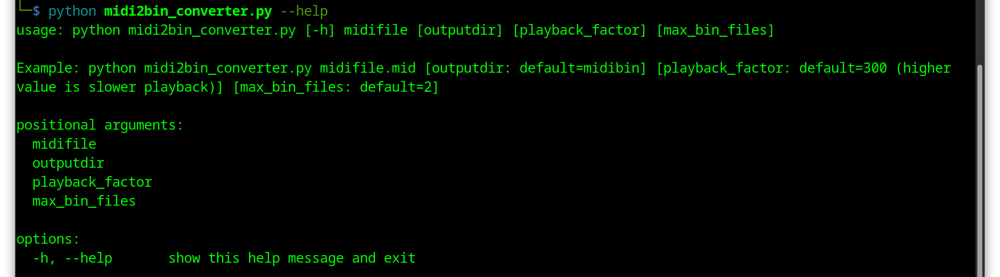
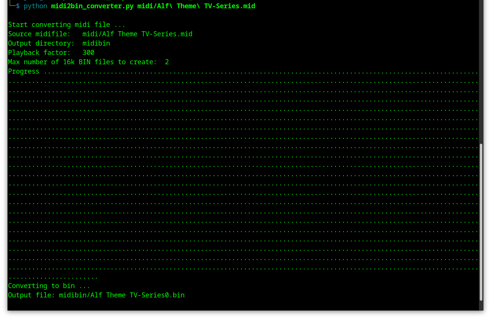
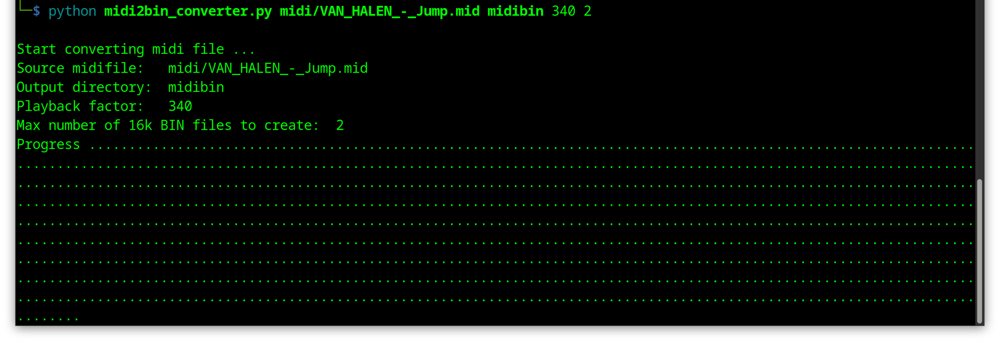
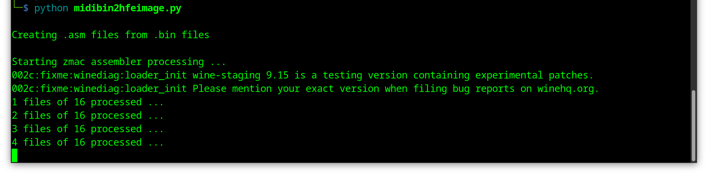
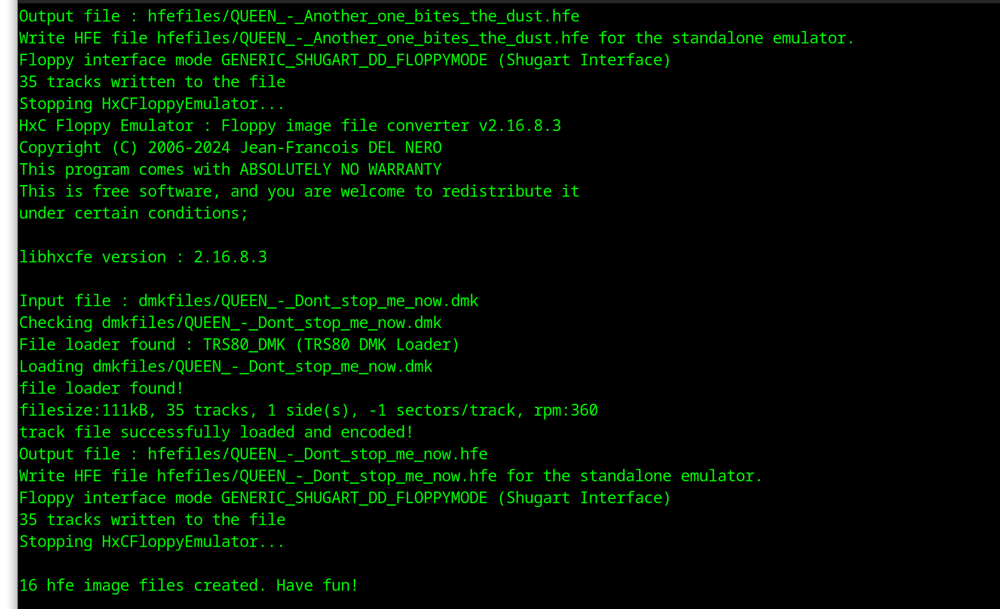
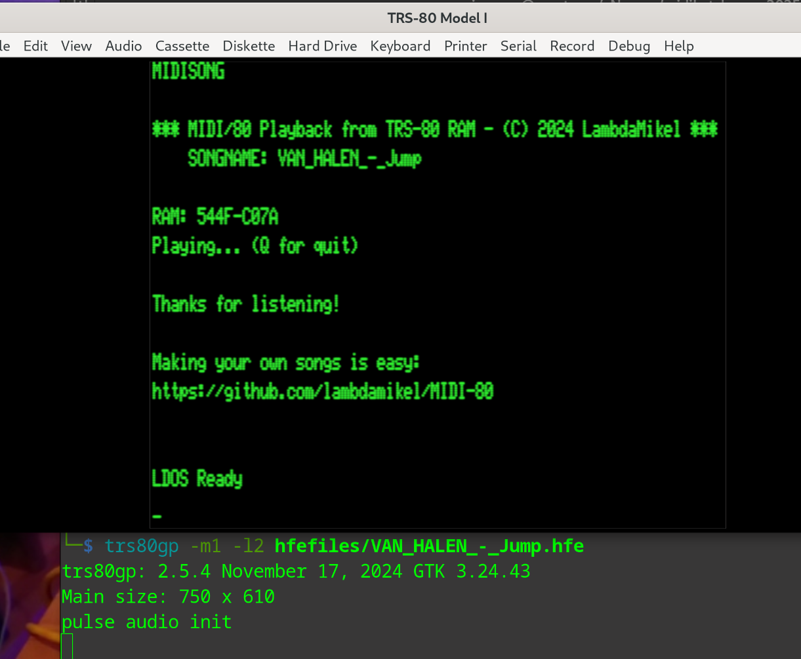

# MIDI Conversion Tools for MIDI/80 and TRS-80  

## midi2bin_converter.py and midibin2hfeimage.py

### Conversion tools for MIDI files to play them with MIDI/80 on the TRS-80

#### Developed by: [Jürgen Wich](https://homecomputerguy.de/en/), [Michael Wessel](https://www.michael-wessel.info/)

#### Provided by: [Michael Wessel](https://www.michael-wessel.info/)

#### License: GPL 3

## About

The MIDI/80 sound card is a hardware extension by [Michael Wessel](https://www.michael-wessel.info/) for the 8-bit computer series Tandy RadioShack TRS-80 (Model I/III/IV). It enables the playback and recording of general MIDI sounds with the TRS-80 and thus adds a sound card to the computer. The idea for the MIDI extension goes back to the Orchestra/80 sound extension from the 1980s, which was not MIDI compatible.
The modern version, on the other hand, is much more flexible because it can be used to play any GM MIDI file. More details about the [MIDI/80](https://github.com/lambdamikel/MIDI-80) card can be found on the project side of Michael Wessel. However, for the TRS-80 to be able to process MIDI files, the data must first be converted and made available as executable files in LDOS format.

This conversion takes place in several steps. To simplify this laborious process and, above all, to convert several files into the correct image format in a batch process, the following helper tools have been developed, which build on each other:

## Overview

**midi2bin_converter.py** is the by Jürgen Wich revised commandline version of the GUI program “Python MIDI -> BIN Converter for the Amstrad CPC” Version 1.1, which was developed by Michael Wessel for MIDI files on the Amstrad CPC and is based on Python (<https://github.com/lambdamikel/BluePillCPC>). It creates a series of machine code files (.bin) from .mid files.

**midibin2hfeimage.py** is a python tool developed by Jürgen Wich, which automates the further workflow. It takes the .bin files, compiles them together with a small playback tool with the zmac Z80 cross assembler and creates LDOS images from them. The image files are then converted to create HxC disk images (.hfe). These images can then be executed e.g. with the Gotek Floppy Emulator or HxC Floppy Emulator on the TRS-80. midibin2hfeimage.py needs the Windows tools trswrite.exe, zmac.exe and hxcfe.exe, which require a Wine installation under Linux. The installation is described here: <https://github.com/jfdelnero/HxCFloppyEmulator>. With Linux you can also use the Windows Version of hxcfe.

## Installation Notes

Both tools were developed and tested under Linux with wine and Windows 11. Only Python3 and some Python modules are required to run the both tools. You can use the tools independently of each other.

Download and unpack the midibatchconv.zip package from this github repository into a subdirectory.

Python3 and the following modules are required to run midi2bin_converter.py:

```bash
pip3 install mido argparse 
```

For midibin2hfeimage.py the following Windows tools are required, which must be located in the same directory as the python script (Please note: Under Linux, a Wine installation is required to run Windows programs.)

- **zmac.exe** by George Phillips - Z80 Macro Cross Assembler - <http://48k.ca/zmac.html>
- **trswrite.exe** by Matthew Reed - Writes files to .dmk Images - <http://www.trs-80emulators.com/trsread-trswrite/>
- **hxcfe.exe** - Commandline Floppy Emulator and Image Converter - <https://github.com/jfdelnero/HxCFloppyEmulatorfloppy_drive_emulator/> (you can use the Windows Version also with wine on Linux)

These tools are not included for copyright reasons, but can be downloaded and used free of charge for private purposes; hence, you should have the following Windows executables in the `midibatchconv` root directory: 
```
hxcfe.exe
trswrite.exe
zmac.exe
```

Installation on Ubuntu: 

```bash
# Setup example wine on Ubuntu
# Install Wine 32-Bit
sudo dpkg --add-architecture i386 && sudo apt-get update && sudo apt-get install wine32:i386

# Set win64 for wine
export WINEARCH=win32
export WINEPREFIX=$HOME/.wine
wineboot

# To execute Windows programs under linux directly (without wine ...)
sudo apt install wine-binfmt
sudo apt install binfmt-support
sudo update-binfmts --import /usr/share/binfmts/wine
```

Note: depending on your system, you may have to use 

```
export WINEARCH=win64
```

instead. 


All further actions are carried out in the unpacked script directory.

## Usage

### midi2bin_converter.py

Copy your MIDI files to be converted (.mid) into a previously created subdirectory:

```bash
mkdir -p midi

cp <source folder/*.mid> <midibatchconv folder>/midi/

python3 midi2bin_converter.py --help
```



Execution examples:

```bash
python3 midi2bin_converter.py midi/alf.mid
```

This converts the MIDI file alf.mid and creates a maximum of two .bin files in the output directory “midibin” with a playback factor of 300 (default parameters).

During execution, the script displays the parameters used for the conversion. The progress is then displayed using consecutive dots.



Basically midi2bin_converter.py always creates 16 kB chunks of BIN files. This makes it possible to convert MIDI songs only partially in order not to exceed the maximum memory size when using the TRS-80. For example, if the TRS-80 has the maximum RAM expansion level of 48 kB, then a maximum of 2 x 16 kB = 32 kB of MIDI data can be processed with it (the rest of the memory is required by the operating system and the MIDI playback tool). Note: The more complex the MIDI data, the shorter the execution time of the song.

```bash
python3 midi2bin_converter.py midi/alf.mid midibin 350 3
```

This creates a maximum of three BIN files from the MIDI file alf.mid in the output directory “midibin” with a slower playback factor of 350. The playback factor of 300 proves to be suitable for most songs in order to play them on the TRS-80 Model I at the correct speed. If the playback speed is too high in some cases, a higher playback factor can be used. A lower value increases the speed.

**Note:** Ensure that the parameters are in the correct order and complete!



Example to convert all MIDI files in a subdirectory with default parameter:

```bash
while read i; do python midi2bin_converter.py "midi/${i}"; done <<< $(ls midi)
```

### midibin2hfeimage.py

This python script handles the further workflow process to create HxC compatible .hfe images from the .bin files. These .hfe image files are then copied to a USB stick or SD card for subsequent use with a Gotek floppy emulator or HxC floppy emulator with the TRS-80.

The converted MIDI files must be located in the “midibin” subdirectory (see midi2bin_converter.py above).

**Note:** You can use spaces, upper/lower case letters, hyphens or underscores in the file names. However, do not use any other special characters, such as apostrophes or similar.

Furthermore, the following executable files must be located in the same directory as midibin2hfeimage.py:

- zmac.exe
- trswrite.exe
- hxcfe.exe (and it's library files)

(see Installation of the requirements above)

```bash
# Start the conversion process and create image files for the TRS-80 Model 1:
python3 midibin2hfeimage.py
# or
python3 midibin2hfeimage.py 1

# for Model 3 image files use:
python3 midibin2hfeimage.py 3
```

You can create image files for the Model 1 or Model 3 by adding 1 or 3 as start parameter. If you want to change the default directories, you can change this directly in the script. The template names for the ASM file and the LDOS image can also be changed directly in the script. The python script creates all temporary directories as required, as well as the output directory for the .hfe files.

midibin2hfeimage.py performs the following tasks:

1. creates an .asm file for each song in the temporary folder “asmfiles” and replaces the song title and the file names for the corresponding song to be compiled with it.
2. compiles the .asm files with zmac Z80 Cross Assembler and creates corresponding .cmd files in the temporary subdirectory “cmdfiles”
3. copies the LDOS image for each song from the template into the temporary subdirectory “dmkfiles”
4. trswrite then copies the corresponding .cmd file into the .dmk image with the target name MIDISONG.CMD (so that the LDOS autostart function can later execute the file on boot).
5. hxcfe is used to create the .hfe images in the subdirectory “hfefiles” from the .dmk image files.

**Note:** The supplied LDOS image in version 5.3.1 is adapted so that only the most necessary system files are available to boot from. In addition, the autostart function has been activated, which loads and executes a file called MIDISONG/CMD from diskette.

These .hfe image files can then be copied to a USB stick or SD card to be used with a Gotek Floppy Emulator or HxC Floppy Emulator with the TRS-80.

The TRS-80 boots from the .hfe image file. The autostart function automatically loads the MIDISONG/CMD file and executes it. If you do not want to use the autostart function, simply rename the CMD file after first boot.

Some screenshots:



Finished:



Loading hfe image with trs80gp emulator:



Have fun with it!

## Troubleshooting

If you find that your MIDI songs play too slow or too fast, change the following constants; for the Model 1, change `canyon_asm.m1.template`:

```
        ;; Optional use a constant value for playback speed
        ld a, 5 ; Playback speed
```

and for the Model III, have a look at `canyon_asm.m3.template`:

```
        ;; Optional use a constant value for playback speed
        ld a, 4 ; Playback speed
```

## Acknowledgements

- [George Phillips](http://48k.ca/)
- [Jürgen Wich](https://homecomputerguy.de/en/)
- [Matthew Reed](http://www.trs-80emulators.com/trsread-trswrite/)
