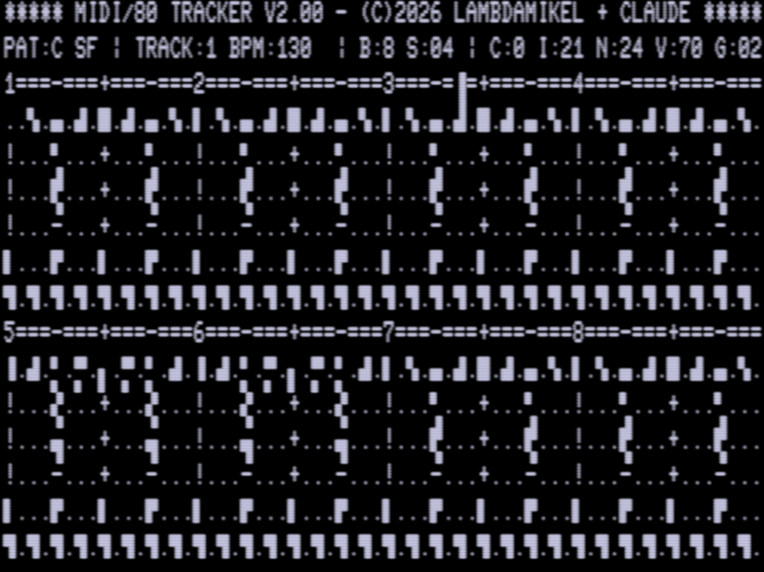
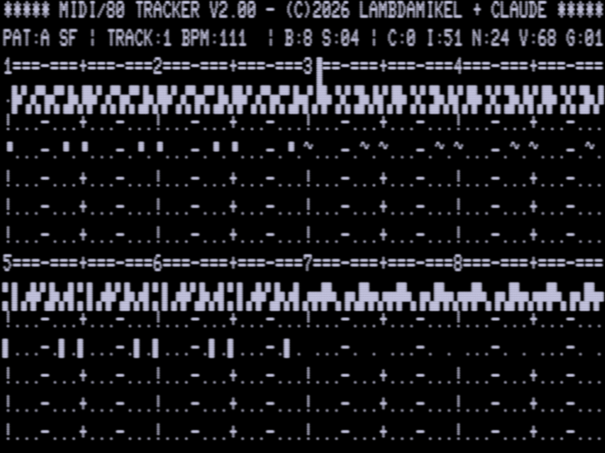
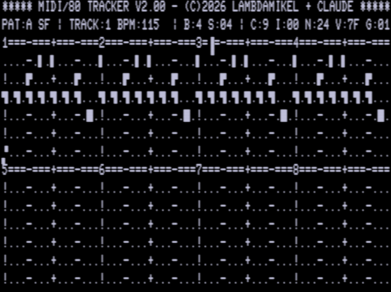

# TRACKER demo songs

Three songs for the MIDI/80 TRACKER, written to show off different sides of
it. Each is a complete `DUMP` file - the core dump TRACKER writes with `S`
and reads back with `L` - together with a `.MID` rendering of the same music.

| song | style | tracks | plays at | patterns |
|------|-------|--------|----------|----------|
| `BOOGIE`   | 12 bar blues shuffle in C | bass, two organ voices, lead guitar, 2 drum tracks | 140 BPM | A+B is one 12 bar chorus |
| `SEQUENCE` | Berlin school 16th note sequencer in A minor | two sequences, synth bass, pad, lead, drums | 120 BPM | builds over 5 patterns |
| `DRUMS`    | six voice drum machine | all six tracks on channel 10 | 125 BPM | 4 bar patterns chained |

Playing on a Model III, left to right: the boogie grid, the 16th note
sequence, and the drum machine.







`BOOGIE` plays once and stops; `SEQUENCE` and `DRUMS` loop (`*` in the song
row). `DRUMS` sets `channeltracks` to channel 10 on every track, which turns
TRACKER back into the six voice drum machine it started life as.

## Disk images

Each song ships as a bootable disk that also carries `TRACKER7/CMD` (V2.00),
so you can boot it, type `TRACKER7`, press `L` and then `Y`, and play.

| | Model III / 4 | Model I |
|---|---|---|
| JV3 / JV1 | [`trs-80/model-3/dsk/BOOGIE.DSK`](../trs-80/model-3/dsk/BOOGIE.DSK) etc. | [`trs-80/model-1/dsk/boogie.dsk`](../trs-80/model-1/dsk/boogie.dsk) etc. |
| HFE (Gotek/HxC) | `trs-80/model-3/hfe/BOOGIE_DSK.hfe` etc. | `trs-80/model-1/hfe/boogie_dsk.hfe` etc. |

The Model I disk was very nearly full, so `TRACKER5/CMD`, `TRACKER6/CMD`,
`BASIC/OV2`, `BASIC/OV4` and `DATECONV/CMD` were removed to make room for the
22645 byte song. `TRACKER7/CMD` (V2.00) stays. The Model III disk had plenty
of space and keeps all three tracker versions.

Since TRACKER always reads and writes a file called `DUMP`, one song needs
one disk. The raw `DUMP` files are here too if you would rather place them
yourself with `tools/ldoswrite.py`.

## The same song is faster on a Model III than a Model I

TRACKER's step delay is counted in Z-80 T-states, so a given tempo byte
produces the same number of T-states on both machines - but the Model I's
clock is 1.774 MHz against the Model III's 2.028 MHz, so everything plays
12.5% slower there. That is why TRACKER carries two BPM constants. The three
songs land at 140/120/125 BPM on a Model III and 122/105/109 BPM on a Model I.

## A note on the BPM readout

These songs are written to the tempo they *actually play at*, which is not
what TRACKER's `BPM:` field reports. `BOOGIE` plays at 140 BPM but the
readout shows 130.

V2.00's tempo is time based: a step ends once an accumulator of estimated
elapsed time reaches `steptarget = (3346 + tempo*112) * 16` T-states. The
estimate is assembled from fixed per-call costs (`PASS_U`, `SHORTDLY_U`,
`WHLSLICE_U` ...), and the one covering idle main loop passes runs high, so
the accumulator reaches the target before that much time has really passed.

Measured in trs80gp by tracing the port 8 writes of a reference voice at
tempo 40/80/120/160/200, the real step period is linear in tempo to within
0.08%:

```
actual   = 62778 + 1547.9 * tempo   T-states     (measured)
steptarget = 53536 + 1792.0 * tempo T-states     (what TRACKER assumes)
```

| tempo | assumed T | actual T | ratio | BPM shown | BPM real |
|------:|----------:|---------:|------:|----------:|---------:|
|  40 | 125216 | 124724 | 0.996 | 242.9 | 243.8 |
|  80 | 196896 | 186690 | 0.948 | 154.5 | 162.9 |
| 120 | 268576 | 248444 | 0.925 | 113.2 | 122.4 |
| 160 | 340256 | 310236 | 0.912 |  89.4 |  98.0 |
| 200 | 411936 | 372528 | 0.904 |  73.8 |  81.6 |

So the readout is honest around tempo 40 and reads up to ~10% slow at tempo
200; the machine always plays at or faster than it claims. Nothing downstream
is harmed - the MIDI clock output is self-normalising at exactly 6 clocks per
step, so anything synced to it follows the real tempo - but the number on
screen is optimistic. Correcting it would mean changing `TEMPOBASE` from 3346
to about 3893 and the multiplier from 112 to 97. **That change has not been
made**: the whole calibration was measured under emulation only. V2.00 itself
has since been confirmed on a real Model III, but nobody has yet timed a song
against a stopwatch there, which is what it would take to justify moving those
constants. If a song ever sounds off-tempo on real hardware, this is the first
thing to re-check - eight bars of `BOOGIE` should take about 13.7 seconds.

Note also that the step period varies by only 1.6% between a pattern with one
note per two steps and one with all six tracks firing on every step, so the
hand tuning that equalises busy and empty steps is holding up well.

## Verification

Everything here was checked against the emulated machine rather than trusted:

* each `DUMP` was loaded into TRACKER7 under trs80gp and the on-screen grid
  decoded back to notes - 767 cells per pattern, 0 mismatches
* song playback was started and every `out (8),a` traced with its accumulator
  value, giving the actual MIDI byte stream; all 817 note-ons across the three
  songs matched the composition on channel, note number, velocity and timing,
  with 0 unmatched
* that captured stream is saved as `*-TRS80.mid`, so those files are literally
  what the emulated TRS-80 put on the wire, jitter and all
* measured step jitter was 0.13 to 0.75 ms, and measured tempo landed within
  0.1% of target for all three songs
* the `DUMP` in every disk image reads back byte-identical, and the Model III
  images were booted and played from both `.DSK` and `.hfe`

The Model I images boot and run `TRACKER7/CMD` from the modified image, but
the load confirmation could not be driven in the harness: LDOS 5.3.1's
keyboard driver does not hand TRACKER's `@KEY` prompt the injected `Y`. That
is a limitation of the test setup, not a known defect - if a real Model I
refuses to confirm the `Y/N` prompt, suspect lowercase and try `SHIFT-Y`.

## Files

| | |
|---|---|
| `*.DUMP` | the song files themselves, load with `L` |
| `*.mid` | the composition as a standard MIDI file, at the real tempo |
| `*-TRS80.mid` | captured from the emulated TRS-80's actual port 8 output |
| `../tools/mksong.py` | the song format and a small composing API |
| `../tools/demosongs.py` | these three songs, as source |
| `../tools/midi2wav.py` | rough offline renderer, for when there is no synth |

To write your own, edit `tools/demosongs.py` and run it; see
`tools/README.md` for the layout of the `DUMP` file.
